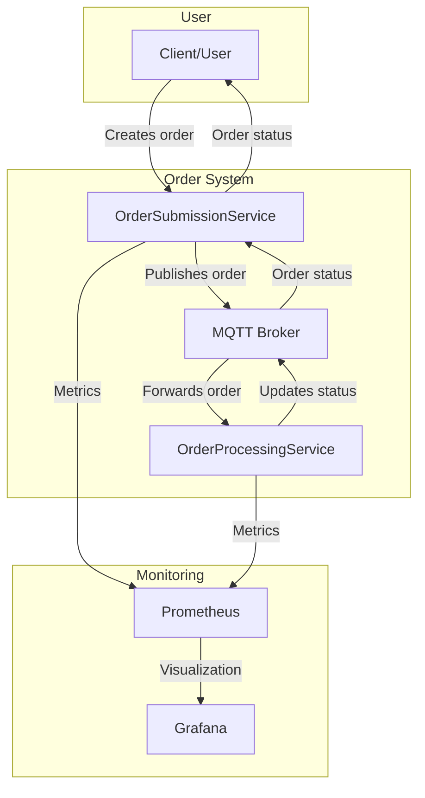
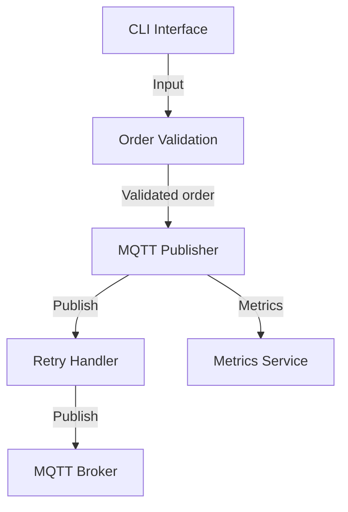
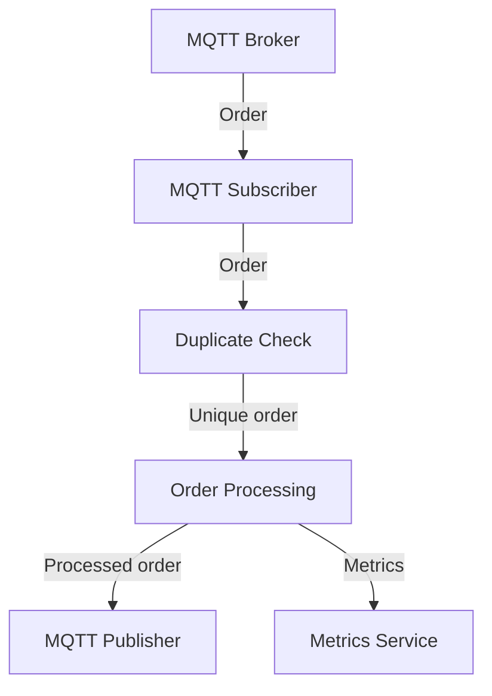

# System Architecture Diagram

## High-Level Architecture

## Service Internal Structure

### OrderSubmissionService

### OrderProcessingService

## Technical Implementation

- **Programming Language**: C# (.NET 8.0)
- **Messaging**: MQTT (MQTTnet 4.3.1)
- **Monitoring**: Prometheus + Grafana
- **Logging**: Microsoft.Extensions.Logging
- **Dependency Injection**: Microsoft.Extensions.DependencyInjection

## Data Flow

1. Client creates an order through OrderSubmissionService
2. OrderSubmissionService validates the order and generates a unique ID
3. Order is published to MQTT queue
4. OrderProcessingService receives the order and checks for duplicates
5. Order is processed and status is updated
6. Updated status is published back to MQTT queue
7. OrderSubmissionService receives the updated status
8. Metrics are collected to Prometheus and visualized in Grafana 