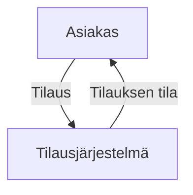
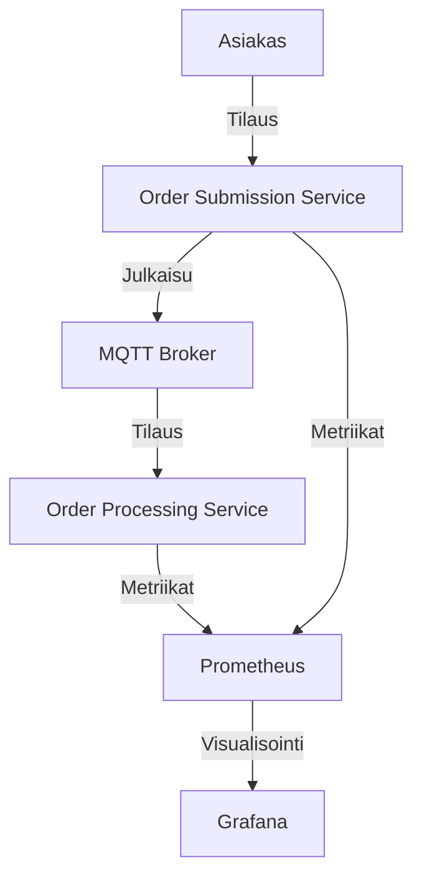
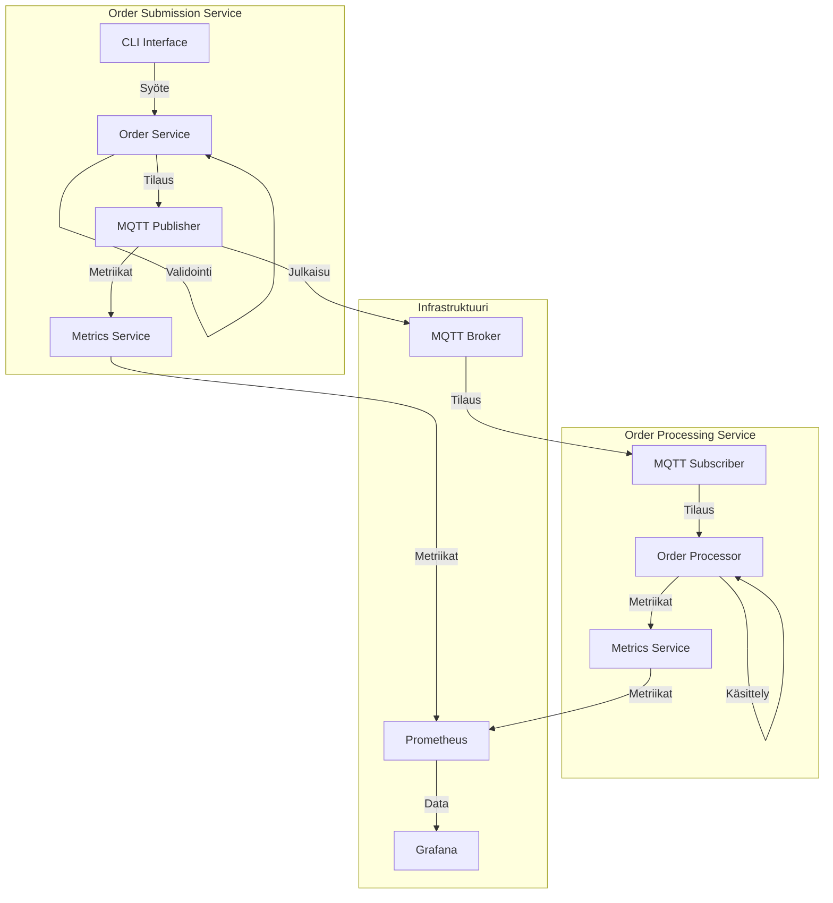
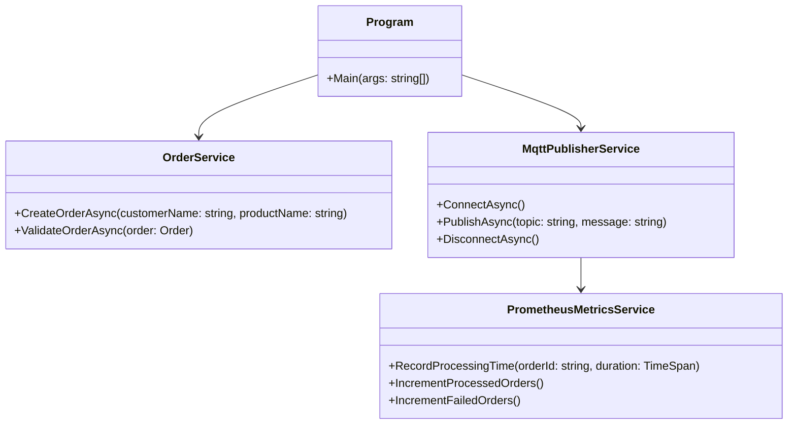
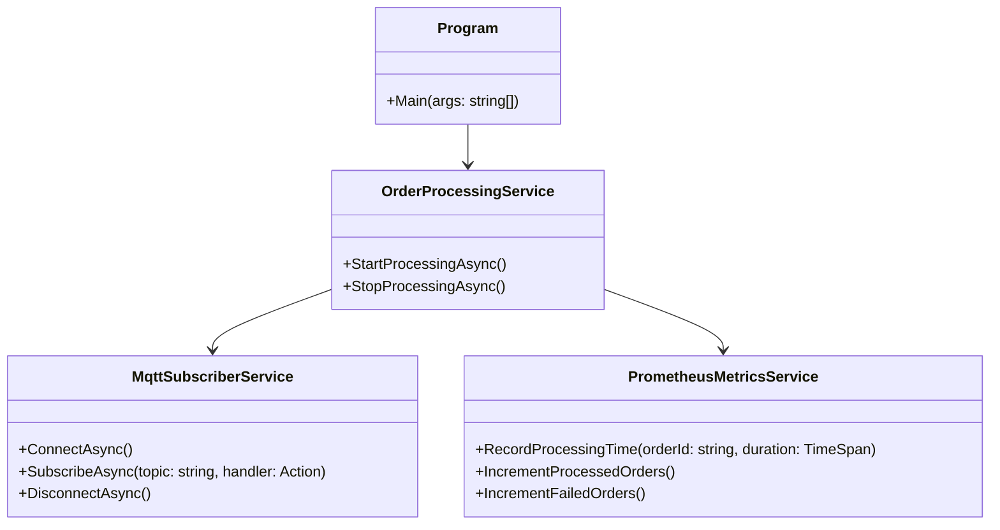

# C4-tason arkkitehtuurikaavio

## Taso 1: Järjestelmäkonteksti

```mermaid
graph TB
    Client[Asiakas] -->|Tilaus| System[Tilausjärjestelmä]
    System -->|Tilauksen tila| Client
```

## Taso 2: Kontainerit

```mermaid
graph TB
    Client[Asiakas] -->|Tilaus| OSS[Order Submission Service]
    OSS -->|Julkaisu| MQTT[MQTT Broker]
    MQTT -->|Tilaus| OPS[Order Processing Service]
    OPS -->|Metriikat| Prometheus[Prometheus]
    OSS -->|Metriikat| Prometheus
    Prometheus -->|Visualisointi| Grafana[Grafana]
```

## Taso 3: Komponentit

```mermaid
graph TB
    subgraph "Order Submission Service"
        CLI[CLI Interface] -->|Syöte| OrderService[Order Service]
        OrderService -->|Validointi| OrderService
        OrderService -->|Tilaus| Publisher[MQTT Publisher]
        Publisher -->|Metriikat| Metrics1[Metrics Service]
    end

    subgraph "Order Processing Service"
        Subscriber[MQTT Subscriber] -->|Tilaus| Processor[Order Processor]
        Processor -->|Käsittely| Processor
        Processor -->|Metriikat| Metrics2[Metrics Service]
    end

    subgraph "Infrastruktuuri"
        Publisher -->|Julkaisu| MQTT[MQTT Broker]
        MQTT -->|Tilaus| Subscriber
        Metrics1 -->|Metriikat| Prometheus[Prometheus]
        Metrics2 -->|Metriikat| Prometheus
        Prometheus -->|Data| Grafana[Grafana]
    end
```

## Taso 4: Koodi

### Order Submission Service

```mermaid
classDiagram
    class Program {
        +Main(args: string[])
    }
    class OrderService {
        +CreateOrderAsync(customerName: string, productName: string)
        +ValidateOrderAsync(order: Order)
    }
    class MqttPublisherService {
        +ConnectAsync()
        +PublishAsync(topic: string, message: string)
        +DisconnectAsync()
    }
    class PrometheusMetricsService {
        +RecordProcessingTime(orderId: string, duration: TimeSpan)
        +IncrementProcessedOrders()
        +IncrementFailedOrders()
    }
    Program --> OrderService
    Program --> MqttPublisherService
    MqttPublisherService --> PrometheusMetricsService
```

### Order Processing Service

```mermaid
classDiagram
    class Program {
        +Main(args: string[])
    }
    class OrderProcessingService {
        +StartProcessingAsync()
        +StopProcessingAsync()
    }
    class MqttSubscriberService {
        +ConnectAsync()
        +SubscribeAsync(topic: string, handler: Action<string>)
        +DisconnectAsync()
    }
    class PrometheusMetricsService {
        +RecordProcessingTime(orderId: string, duration: TimeSpan)
        +IncrementProcessedOrders()
        +IncrementFailedOrders()
    }
    Program --> OrderProcessingService
    OrderProcessingService --> MqttSubscriberService
    OrderProcessingService --> PrometheusMetricsService
``` 