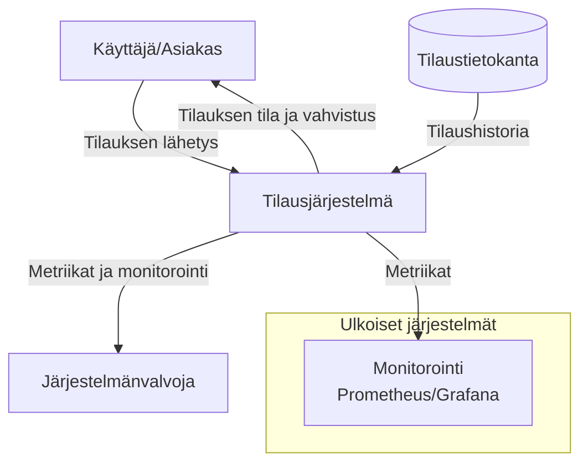
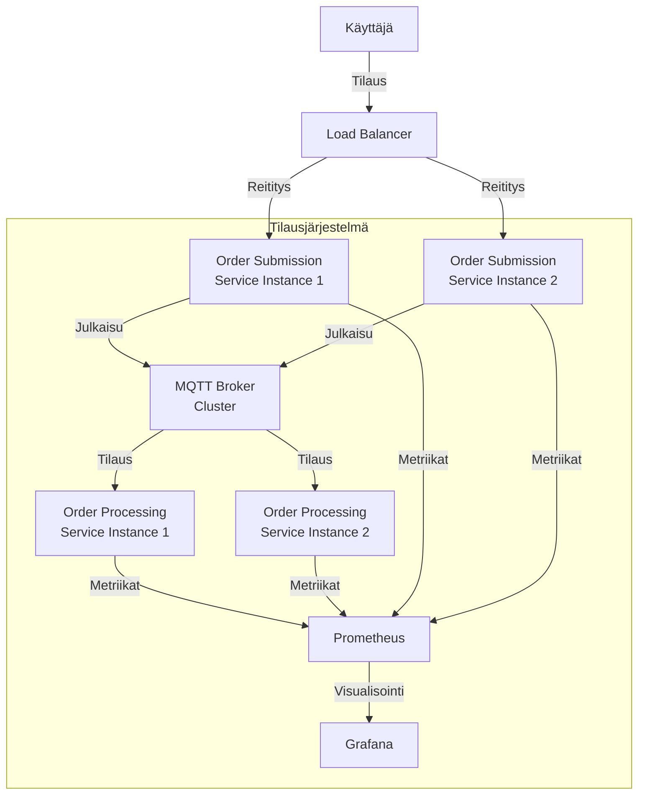
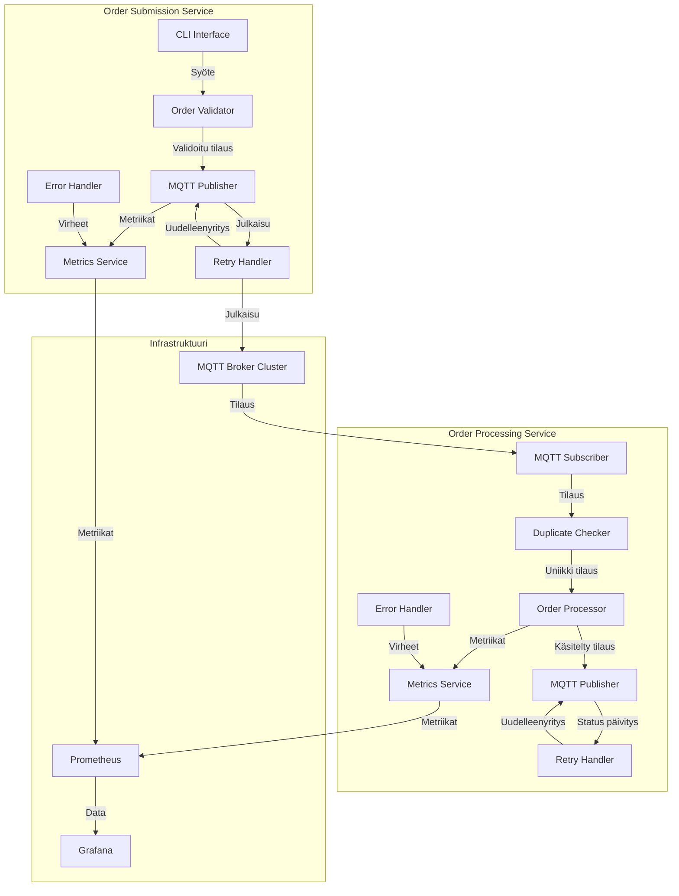
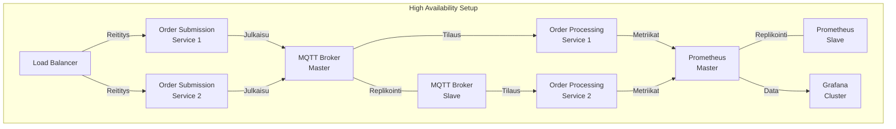

# C4-tason arkkitehtuurikaavio

## Taso 1: Järjestelmäkonteksti

```mermaid
graph TB
    Client[Käyttäjä/Asiakas] -->|Tilauksen lähetys| System[Tilausjärjestelmä]
    System -->|Tilauksen tila ja vahvistus| Client
    System -->|Metriikat ja monitorointi| Admin[Järjestelmänvalvoja]
    DB[(Tilaustietokanta)] -->|Tilaushistoria| System
    subgraph "Ulkoiset järjestelmät"
        Monitoring[Monitorointi\nPrometheus/Grafana]
    end
    System -->|Metriikat| Monitoring
```

## Taso 2: Kontainerit

```mermaid
graph TB
    subgraph "Tilausjärjestelmä"
        OSS1[Order Submission\nService Instance 1] -->|Julkaisu| MQTT[MQTT Broker\nCluster]
        OSS2[Order Submission\nService Instance 2] -->|Julkaisu| MQTT
        MQTT -->|Tilaus| OPS1[Order Processing\nService Instance 1]
        MQTT -->|Tilaus| OPS2[Order Processing\nService Instance 2]
        OPS1 -->|Metriikat| Prometheus[Prometheus]
        OPS2 -->|Metriikat| Prometheus
        OSS1 -->|Metriikat| Prometheus
        OSS2 -->|Metriikat| Prometheus
        Prometheus -->|Visualisointi| Grafana[Grafana]
    end
    Client[Käyttäjä] -->|Tilaus| LoadBalancer[Load Balancer]
    LoadBalancer -->|Reititys| OSS1
    LoadBalancer -->|Reititys| OSS2
```

## Taso 3: Komponentit

```mermaid
graph TB
    subgraph "Order Submission Service"
        CLI[CLI Interface] -->|Syöte| Validator[Order Validator]
        Validator -->|Validoitu tilaus| Publisher[MQTT Publisher]
        Publisher -->|Julkaisu| RetryHandler[Retry Handler]
        RetryHandler -->|Uudelleenyritys| Publisher
        Publisher -->|Metriikat| Metrics1[Metrics Service]
        ErrorHandler1[Error Handler] -->|Virheet| Metrics1
    end

    subgraph "Order Processing Service"
        Subscriber[MQTT Subscriber] -->|Tilaus| DupeCheck[Duplicate Checker]
        DupeCheck -->|Uniikki tilaus| Processor[Order Processor]
        Processor -->|Käsitelty tilaus| Publisher2[MQTT Publisher]
        Publisher2 -->|Status päivitys| RetryHandler2[Retry Handler]
        RetryHandler2 -->|Uudelleenyritys| Publisher2
        Processor -->|Metriikat| Metrics2[Metrics Service]
        ErrorHandler2[Error Handler] -->|Virheet| Metrics2
    end

    subgraph "Infrastruktuuri"
        RetryHandler -->|Julkaisu| MQTT[MQTT Broker Cluster]
        MQTT -->|Tilaus| Subscriber
        Metrics1 -->|Metriikat| Prometheus[Prometheus]
        Metrics2 -->|Metriikat| Prometheus
        Prometheus -->|Data| Grafana[Grafana]
    end
```

## Skaalautuvuus ja vikasietoisuus

```mermaid
graph TB
    subgraph "High Availability Setup"
        LB[Load Balancer] -->|Reititys| OSS1[Order Submission\nService 1]
        LB -->|Reititys| OSS2[Order Submission\nService 2]
        OSS1 -->|Julkaisu| MQTT1[MQTT Broker\nMaster]
        OSS2 -->|Julkaisu| MQTT1
        MQTT1 ---|Replikointi| MQTT2[MQTT Broker\nSlave]
        MQTT1 -->|Tilaus| OPS1[Order Processing\nService 1]
        MQTT2 -->|Tilaus| OPS2[Order Processing\nService 2]
        OPS1 -->|Metriikat| PM1[Prometheus\nMaster]
        OPS2 -->|Metriikat| PM1
        PM1 ---|Replikointi| PM2[Prometheus\nSlave]
        PM1 -->|Data| GF[Grafana\nCluster]
    end
``` 